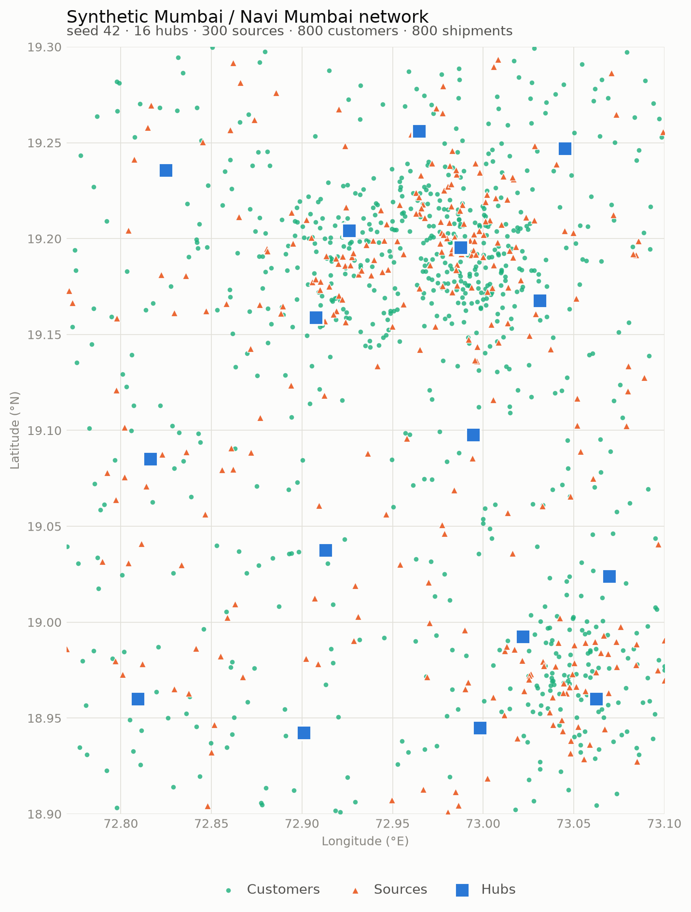

# mumbai-hub-spoke-optimization

Two-stage hub-and-spoke pickup and delivery optimization over a synthetic Mumbai / Navi Mumbai
network. **Stage 1** consolidates ~300 pickup sources into 16 hubs, one OR-Tools CVRP per hub.
**Stage 2** delivers from those hubs to ~800 customers under vehicle capacity and delivery time
windows, using a genetic algorithm written from scratch. Both stages are priced in rupees against a
greedy nearest-neighbour benchmark, and the headline KPI is **cost per drop (₹/delivery)**.

Python 3.11+, `mypy --strict`, 99% line coverage on the solver, cost and baseline modules
(`make cov`), property-based tests on the GA operators and the split procedure. `make test` is the
gate: `ruff` + `mypy --strict` + `pytest`, and no test touches the network.

> **Status: steps 1–8 of 9 are built.** Both stages solve end to end on one seed
> (`make run`), step 7's ablation is reported below, and step 8 has measured the hand-written GA
> against an OR-Tools reference on a matched per-hub budget: **the reference wins by 2.9% per
> drop**, and that margin is a floor rather than an estimate. **Step 9** (multi-seed evaluation with
> per-seed spreads) is outstanding. So every figure here is **one instance, seed 42** — the error
> bars are coming rather than missing, and the one noise floor that has been measured is quoted
> where it matters.

---

## Results as they stand

Seed 42, OSRM road distances, population 150 against a 600-generation budget. The optimized column
is nearest-hub assignment with memetic local search on — the shipping default.

| | greedy benchmark | optimized | |
|---|---|---|---|
| **cost per drop ₹** | 309.01 | **264.63** | **−14.4%** |
| total cost ₹ | 247,204 | 211,704 | −35,500 |
| — variable, ₹9/km | 89,895 | 80,008 | −9,887 |
| — driver, ₹95/h | 37,687 | 35,286 | −2,401 |
| — fixed, ₹1,000/vehicle | 96,000 | 96,000 | 0 |
| — lateness, ₹250/h | 23,622 | 410 | −23,212 |
| stage 1 inbound ₹ | 69,307 | 66,261 | −4.4% |
| stage 2 final mile ₹ | 177,897 | 145,443 | −18.2% |
| distance km | 9,988.4 | 8,889.8 | −11.0% |
| vehicle-days | 96 | 96 | 0 |
| window violations | 68 | 9 | −59 |
| lateness h | 94.5 | 1.6 | −92.9 |

**Where the gain actually comes from, since the decomposition is not flattering.** Two thirds of it
— ₹23,212 of ₹35,500 — is time-window penalty the benchmark incurs because it ignores windows
entirely, by construction. On the three physical components alone (distance, driver time, fleet) the
improvement is **−5.5%**, and the fleet does not shrink at all: both plans deploy 96 vehicle-days,
because vehicle count is floored by total mass and neither solver can change the mass. What the
optimizer buys is *shorter tours that arrive on time*, not a smaller fleet.

**Read −14.4% as a lower bound.** The optimized run is truncated: every hub stops on
`stagnation_limit = 75` rather than exhausting the 600-generation budget (76–463 generations,
median 97), and 15 of the 16 hubs are sitting at an adaptive time-window penalty of ×8 or above when
they stop — i.e. they stop against a distorted objective rather than the one being reported. On the
largest hub this has been measured directly: three different penalty schedules each recover
**₹650–695** there, worth ≈0.3 percentage points of headline on that one hub alone. The mechanism
is localised and understood but not solved, and the candidate fix ships switched off — limitation 9
is the full account. Step 9 re-measures the headline once the penalty schedule is settled.

Also measured, both single-instance:

- **Memetic local search is worth −2.84%** per drop (nearest-hub) and −2.27% (balanced), clearing
  the GA-seed noise floor at 3.30× and 2.68×. It is an upper bound, not an estimate — the arms were
  not truncated identically, and the asymmetry flatters local search. Limitation 7.
- **Capacity-balanced hub assignment does not pay: +1.74%.** It removes the imbalance it targets and
  costs money on *both* legs. What it buys instead is variance reduction — 3.8× steadier across GA
  seeds. Limitation 6.

Step 7's full working — predictions registered before the run, both replications, the noise
probe — is in [`docs/step7-ablation.md`](docs/step7-ablation.md).

### How good is the hand-written GA? 2.9% off OR-Tools, measured

The point of step 8. `make run ARGS="--reference"` re-solves the *same* final-mile problem with an
OR-Tools `RoutingModel` and reports the gap. Same instance, same matrices, same inbound plan, same
customer-to-hub mapping, same no-split rule, both columns scored by the same `evaluate_solution()`,
and **each hub given exactly the wall clock its own GA search spent** — median 237 s, range
10–1,389 s. The GA was not tuned against this figure; the gap is the result.

| seed 42, nearest, local search on | greedy | GA | OR-Tools reference |
|---|---|---|---|
| **cost per drop ₹** | 309.01 | 264.63 | **257.02** |
| **vs greedy** | — | −14.4% | **−16.8%** |
| stage 2 final mile ₹ | 177,897 | 145,443 | **139,354** |
| distance km | 9,988.4 | 8,889.8 | 8,346.1 |
| vehicle-days | 96 | 96 | 96 |
| window violations | 68 | 9 | 3 |
| lateness h | 94.5 | 1.6 | 1.1 |

**The reference is ahead by ₹7.61 per drop, −2.9% on the total and −4.2% on the final-mile leg.**
The ₹6,089 decomposes as variable ₹4,893 (80.4%), driver ₹1,056 (17.3%), lateness ₹140 (2.3%),
fixed ₹0 — and the four sum to the leg delta exactly. Vehicle-days are identical because both
solvers sit at the per-hub mass floor, so **none** of the gap is fleet sizing: it is 544 km of
shorter routing and the driver time that comes with it.

**Read −2.9% as a floor on OR-Tools' advantage, not an estimate of it.** Three things bias the
comparison and all three run *against* the reference:

1. **It optimises a static traffic proxy.** A `RoutingModel` fixes arc costs before searching, so
   the reference chooses tours under a dispatch-hour-constant multiplier and a static arrival
   timeline, then gets scored under the cumulative band-blended model every other figure here uses.
   It is optimising a slightly wrong objective and still wins.
2. **It under-prices lateness by 0.64%.** Soft cumul bounds take an integer coefficient, so ₹250/h
   becomes 69 milli-INR/s against an exact 69.44. It still cut violations from 9 to 3.
3. **13 of its 16 hubs were stopped by the clock**, having spent the matched budget to the tenth of
   a second; only three finished inside it. More time would likely widen the gap, not close it.

**So what is the hand-written GA for?** Not for beating OR-Tools — it does not, and limitation 11
says so without hedging. What step 8 establishes is that the architecture in `src/stage2/` lands
within 2.9% of a mature constraint solver on the same problem and the same budget, while beating the
greedy control by 14.4%. That architecture — a chromosome with no vehicle boundaries, an exact
`split()` deriving them by shortest path, no repair operator anywhere in the codebase, capacity made
structural rather than penalised, an adaptive window penalty, a memetic 2-opt — is the thing this
repository exists to show, and it is now measured against something rather than asserted. The 2.9%
is the price of the demonstration, reported rather than tuned away.

The run prints its own caveats: per-hub solver status, which hubs the clock stopped, and a `WARNING`
if `--deterministic` capped the reference at its first solution, in which case the table is not a
measurement at all.

---

## The instance

<picture>
  <source media="(prefers-color-scheme: dark)" srcset="figures/instance_seed42_dark.png">
  
</picture>

Generated by `make data` from a seed alone — no network access, no external data. 55% of sources and
customers are drawn around four density clusters, whose centres are themselves placed at random
inside the box, and the rest are uniform; hubs are k-means centroids over a candidate pool. The
clusters are what make the instance non-trivial — nearest-hub assignment is lopsided precisely
because the clusters do not sit one per hub. Shipments are 37.5 kg each against a 750 kg vehicle —
a Tata Ace class SCV — and 75% of customers carry a 2–4 hour delivery window.

The seed fixes everything downstream, including the distance-matrix cache key, which is what makes a
run repeatable. All data is synthetic; see limitations 2 and 4.

---

## Architecture

| Stage | Problem | Scope | Solver |
|---|---|---|---|
| 1 — inbound | consolidation | ~300 sources → 16 hubs; tours are hub → sources → hub | hub assignment (nearest-hub by default; min-cost-flow balancing as the measured alternative), then one OR-Tools CVRP per hub |
| 2 — final mile | capacitated VRP with soft time windows | 16 hubs → ~800 customers; tours are hub → customers → hub | hand-written genetic algorithm, one independent GA per hub |

Pickup-before-delivery precedence is enforced **structurally**, by stage ordering: a customer is
served from the hub its parcel actually reached, so no repair operator and no precedence constraint
is needed anywhere in the codebase. The cost of that simplicity is named as limitation 1 — the
decomposition is greedy, and the assignment that is optimal for inbound need not be optimal for
outbound. Step 7 measured that coupling rather than assuming it away.

**Why OR-Tools for Stage 1.** The inbound leg is a textbook CVRP: fixed depot, no time windows,
16 independent subproblems of ~19 stops each. There is nothing to learn from re-implementing guided
local search for it, and OR-Tools' first-solution heuristics plus GLS are a strong, boring baseline.
Hubs do not interact once the assignment is fixed, so this is 16 small models in a process pool
rather than one 285-stop model that would spend its whole time limit on a search space that is
mostly infeasible by construction.

**Why a hand-written GA for Stage 2.** This is the part of the repository that exists to be read.
The final mile is where the problem stops being textbook — soft time windows, a traffic multiplier
that accumulates along the route, and a cost function in which a local move has a global effect —
and it is where a solver's design decisions are visible. Writing it by hand means the encoding, the
operators, the penalty schedule and the local search are all inspectable and all argued for in the
module docstrings. Calling `RoutingModel` again would have hidden exactly the thing worth showing.

**Which is why step 8 measured the gap rather than asserting there wasn't one.** `--reference`
re-solves the *same* Stage 2 problem with OR-Tools, outside the pipeline — a test walks the import
closure to prove the solve path cannot reach it. The answer: **the reference is 2.9% per drop
cheaper**, and the margin is a floor because every proxy in the comparison handicaps it. That is
reported above and as limitation 11, and the GA was not tuned afterwards to narrow it.

### Repository layout

| Path | What lives there |
|---|---|
| `src/config.py` | every tunable and every constant, as frozen dataclasses; nothing is read at module level |
| `src/costs/` | chunked OSRM distance/duration matrix, parquet cache, cumulative traffic model |
| `src/tour.py` | the one place a sequence of stops becomes a timed, band-blended route |
| `src/scoring.py` | `evaluate_solution()` — the single scoring path, called by baseline and pipeline alike |
| `src/baseline/greedy.py` | the frozen control; forbidden by test from importing either stage |
| `src/stage1/` | `assignment.py` (min-cost flow), `cvrp.py` (per-hub OR-Tools under a spawn pool) |
| `src/stage2/` | `split.py`, `operators.py`, `local_search.py`, `penalty.py`, `ga.py`, `solve.py` |
| `src/cli/` | the `make` entry points; the only files in the repo allowed to `print()` |

---

## Inside the Stage 2 GA

Four decisions carry the design. Each is argued at length in its own module docstring.

**The chromosome has no vehicle boundaries.** It is a plain permutation of one hub's customers, and
`split()` derives the vehicle boundaries by shortest path over an auxiliary DAG: node *i* means "the
first *i* customers have been served", arc *(i, j)* means "one vehicle serves positions *i+1..j* as
a single tour", weighted by what that tour costs. This is route-first / cluster-second, after
Prins (2004). The alternative — writing delimiters into the chromosome — makes crossover recombine
the cut points too, which emits over-capacity tours constantly and needs a repair operator; repair
then decides what the population looks like, instead of selection. Here the delimiters are never
searched. They are *derived optimally* for whatever order the GA proposes, so every chromosome maps
to a feasible plan, and to the best plan its order admits.

**Capacity is hard by construction; time windows are soft.** An arc whose load exceeds one vehicle
is never created in the DAG, so an over-capacity tour is not expensive — it is unrepresentable.
Capacity never appears as a fitness penalty anywhere. Lateness, by contrast, is priced into the arc
weight, so the search prefers a time-feasible partition but still returns a complete plan when none
exists. That is the point of a soft constraint.

**The time-window penalty adapts, and the two objectives are kept apart.** The multiplier starts at
×1 and doubles every 10 generations toward a 10% violation rate, capped at ×64. Selection, local
search and the diversity guard all rank on that *search* objective; the incumbent returned at the
end is tracked on the **configured** objective at ×1, because that is what `evaluate_solution()`
will charge and it is the only number that means anything outside the loop. Keeping them separate is
what lets the penalty move freely without the answer depending on where the multiplier happened to
be when the run stopped.

**Local search is Lamarckian and intra-route only.** Each generation, 10% of the population has each
of its vehicle tours 2-opted, and the improvement is written back into the chromosome so the GA
inherits it. Moves are never evaluated across two routes: a route holds at most 20 stops, so a full
2-opt neighbourhood is 190 candidates priced in microseconds, whereas proposing moves on the whole
permutation would cost a full re-split per candidate to buy work-shifting that `split()` is free to
do on the next generation anyway. There is **no delta evaluation**, deliberately — `beta` is
time-denominated and traffic accumulates along the route, so reversing a segment changes the arrival
time, and therefore the lateness, at every later stop. Every candidate is priced in full.

Supporting parts: OX crossover and or-opt mutation (segment length ≤ 3), both property-tested to
return a permutation of their input; tournament selection at *k* = 5; elitism 3; a diversity guard
that mutates a duplicate child rather than spending a generation on a converged population; and
three nearest-neighbour seeds from distinct starting stops, the rest of the first generation random
— three rather than thirty because greedy orders from different starts agree wherever the greedy
choice is unambiguous, so each extra seed buys less diversity than the random individual it evicts.

**Reproducibility is a design constraint, not a habit.** Per-hub solves run under a
`multiprocessing` **spawn** pool — OR-Tools starts threads and forking a threaded process is
undefined. A worker receives its own sliced matrices in a frozen dataclass and nothing else: no
`Config`, no `Instance`, no `Generator`. Randomness goes through an injected
`np.random.Generator`; there is no global mutable state and no module-level config read anywhere in
`src/`. A shared generator across workers would leave the run succeeding while its numbers quietly
stopped being repeatable, which is the failure mode this structure exists to prevent.

---

## Cost model and traffic

Every reported figure is rupees, from four components:

| Symbol | Component | Unit | Default | Scales with |
|---|---|---|---|---|
| `alpha` | variable running cost | ₹/km | 9.0 | distance |
| `beta` | driver / labour | ₹/hour | 95.0 | duration |
| `gamma` | fixed vehicle | ₹/vehicle/day | 1,000.0 | fleet deployed |
| — | time-window penalty | ₹/hour late | 250.0 | lateness |

Order-of-magnitude figures for a Tata Ace class SCV — 750 kg payload, ~21 kmpl. Capacity and
shipment size are configuration variables, never literals; mixed fleet and mixed shipment sizes are
named roadmap extensions.

Traffic is a static time-of-day multiplier applied **cumulatively along a route**:

| Band | Multiplier |
|---|---|
| 08–11 | 1.6 |
| 11–17 | 1.2 |
| 17–21 | 1.8 |
| 21–08 | 1.0 |

A leg is integrated across every band boundary it crosses, not scaled by the multiplier in force
when it departs. Leaving at 10:45 with 30 minutes of free-flow time, the first quarter-hour is
driven at 1.6× and the remainder at 1.2×, arriving at 11:24:45 rather than 11:33 or 11:21. Because
`beta` is time-denominated, this is what makes *when* a route is driven change what it costs rather
than merely decorate it — and it is why the local search cannot use delta evaluation.
`make providers` prints one leg at five departure times so the blending is visible; five identical
numbers there would mean the multipliers were not being applied at all.

### The distance matrix

Two constraints shape `src/costs/matrix.py`, both load-bearing.

**OSRM caps a `/table` request** at `max-table-size²` cells — 10,000 at the default of 100. This
instance is ~1,116 nodes, or 1.25 million cells, so the matrix is walked as a grid of square blocks
and reassembled. Each request carries only its own block's coordinates: putting all 1,116 in the URL
with index selectors produces a 22 kB request line the server rejects.

**The assembled matrix is cached to parquet**, keyed by `(seed, provider, n_nodes, coord_hash)`.
The GA reads the matrix millions of times per run; without the cache, matrix I/O rather than search
would dominate every runtime figure quoted here. The provider is in the key so a fallback run can
never load an entry written by a road-network run.

---

## Running it

No setup, no Docker, no OSM data — the cost layer has a great-circle fallback:

```bash
make data                                              # seeded instance + the scatter above
.venv/bin/python -m src.cli.run_baseline --no-osrm     # greedy benchmark + metrics table
```

Distances are then haversine × `circuity_factor` (1.30) at 24 km/h. Those are estimates, not road
figures, and every run that uses them says so at `WARNING`. Results from the two providers must not
be compared (limitation 5).

### Real road distances

```bash
make osrm       # one-time: download extract, extract/partition/customize, then start the server
make osrm-up    # start it thereafter; osrm-down to stop
make providers  # sanity check: 8 Mumbai landmarks under both providers, plus the traffic bands
```

`make osrm` takes 15–30 minutes and ~4 GB of RAM, and it does three non-obvious things by hand:

- **Maharashtra from openstreetmap.fr, checked for magic bytes.** Geofabrik publishes India only as
  six multi-state zones with no per-state extract, and a mirror that answers an unknown path with a
  redirect hands you a 9 kB HTML file that `osrm-extract` reports twenty minutes later as `invalid
  BlobHeader size`. The download goes to a temporary name so a bad fetch cannot be mistaken for a
  good one next run.
- **MLD, not CH.** `osrm-partition` + `osrm-customize`, because the contraction-hierarchies
  alternative answers `/table` with durations but **no distances**, and this codebase needs both.
- **Port 5001, not OSRM's usual 5000.** macOS binds 5000 to the AirPlay Receiver, so 5000 fails on a
  fresh clone on every Mac. `RunConfig.osrm_url` and `docker-compose.yml` must agree; a mismatch
  falls back to haversine and reads as an outage rather than a misconfiguration.

`make providers` is also where `circuity_factor` comes from: against a live MLD build, the eight
landmarks give **1.13–1.40, mean 1.28**, which is why the default is 1.30. Long trunk routes sit at
the bottom (Gateway → Thane, 1.13) and short suburban hops at the top (BKC → Powai, 1.40), since
circuity always rises as legs shorten.

---

## Known limitations

Stated plainly, and not softened anywhere else in the repository:

1. **Sequential Stage 1 → Stage 2 is a greedy decomposition.** The hub assignment that is optimal
   for inbound consolidation is not necessarily optimal for outbound delivery. Co-optimization is
   out of scope.
2. **All data is synthetic.** Sources, customers, shipments and time windows are generated from a
   seed; no real order book is involved.
3. **Traffic multipliers are illustrative, not calibrated** against observed Mumbai traffic. They
   are plausible round numbers chosen to make the peak-hour trade-off visible, not measurements.

4. **About a quarter of generated nodes are not on the road network.** The bounding box is a
   rectangle over a city that is not one: it covers the Arabian Sea west of the coast, Thane
   Creek, the harbour and Sanjay Gandhi National Park. Measured against OSRM's `/nearest`, 25%
   of nodes sit more than 500 m from the nearest routable road and 9% more than 1 km, the worst
   4.8 km out. The rate is uniform across hubs, sources and customers — hubs are not
   disproportionately affected, despite being k-means centroids.

   The consequence: OSRM routes between *snapped* positions, so every distance carries a
   displacement error on top of the true road distance. It inflates absolute distance, duration
   and therefore cost per drop. On this instance the realized ratio of road to great-circle
   distance over tour legs is ~1.9, against a true landmark-measured circuity of 1.28; the gap
   is the artefact, not the city. It is visible as per-leg ratios below 1.0, which no real road
   network can produce.

   **It does not bias the comparison.** The same displacement applies identically to the greedy
   baseline, the GA and the OR-Tools reference, since all three route over the same matrix. The
   headline claim is a *relative* improvement over the baseline, and that is unaffected. Absolute
   ₹/drop should be read as inflated.

   Fixing it properly means constraining node placement to the network, which would make
   `generate_instance` depend on a running OSRM — giving up both offline `make data` and the
   guarantee that a seed alone determines the instance, which `coordinate_digest` and the matrix
   cache key rely on. That trade is not worth it for a bias that cancels.

5. **The haversine fallback is not a substitute for OSRM.** `circuity_factor = 1.30` is
   calibrated against real landmarks (see above), so it models road circuity honestly but does
   *not* reproduce OSRM's totals on this instance. Every reported number comes from OSRM; any run
   that falls back logs it at `WARNING`, and results from the two providers must not be compared.

6. **Capacity-balanced hub assignment does not pay here, and it is reported rather than hidden.**
   Nearest-hub assignment is badly lopsided: on seed 42 hub 9 draws 8,850 kg while two hubs draw
   300 kg each. The min-cost flow fixes exactly that — worst hub down to 2,738 kg at the default
   `hub_balance_slack = 1.25` — and the inbound leg gets **1.7% more expensive**: +82 km, and not
   one vehicle saved. Tightening the cap makes it worse, monotonically; a perfectly even split
   (`--slack 1.0`) costs 7.4% more than nearest-hub *and* adds a vehicle.

   The mechanism is that the vehicle floor is set by mass, and mass is not what makes an inbound
   tour expensive. A hub drawing 8,850 kg simply dispatches twelve vehicles, and their tours stay
   inside its own dense catchment. Moving a source to a less-loaded hub buys a long radial leg
   and saves nothing, because the vehicle it would have shared was going to be full either way.
   Balance only starts to pay where it happens to shed a whole vehicle, and at ₹1,000/vehicle
   that is a lumpy, seed-dependent effect rather than a trend.

   So Stage 1's improvement over the baseline — **−4.4%** on the inbound leg, 1,477 → 1,229 km at
   an unchanged 48 tours — is the **CVRP's**, not the assignment's. Both strategies ship, because
   the negative result is the interesting half of the ablation. `make stage1` prints all three
   columns side by side and states the verdict from the numbers.

   **Step 6 suspected the inbound-only verdict was incomplete. Step 7 measured it, and the
   suspicion was wrong.** A customer is served from the hub its parcel reached, so the assignment
   propagates: balancing cuts Stage 2's largest hub from **236 stops to 73** (median 36 → 58).
   Step 6 argued that for a fixed generation budget a flatter distribution is a smaller search
   space per stop, so equal GA effort would buy more optimisation and might repay the 1.7%.

   **It does not. Balancing makes the final mile dearer too**, on the very leg the argument said it
   would help:

   | seed 42, both arms with local search | nearest | balanced | |
   |---|---|---|---|
   | stage 1 inbound ₹ | 66,261 | 67,365 | +1.67% |
   | **stage 2 final mile ₹** | **145,443** | **148,031** | **+1.78%** |
   | total ₹ | 211,704 | 215,396 | +1.74% |
   | cost per drop ₹ | 264.63 | 269.25 | +1.75% |

   The sign holds without local search (151,631 → 153,038) and at every GA seed tried — balanced
   sits above nearest at all three matched seeds, by ₹4.61, ₹5.15 and ₹2.34 per drop. Balanced was
   not starved of search either: it ran a median 210 generations against nearest's 97, because
   smaller hubs are cheaper per generation. More iterations, on a flatter distribution, on the hub
   the argument rested on — and a worse outbound leg.

   **The mechanism is real; it just delivers the wrong good.** Across GA seeds the balanced arm is
   **3.8× steadier** than nearest — range ₹0.61 against ₹2.34. A smaller search space per stop buys
   a *more consistent* answer, not a better one: lower variance on a mean ₹4/drop worse.

   The reason is the same one that sinks the inbound leg. Balancing does buy time-window
   compliance — 7 violations and 0.7 h lateness against nearest's 9 and 1.6 h — and pays for it in
   **205 km** (9,095 km against 8,890 km). At ₹9/km plus driver time the distance dominates, on the
   outbound leg exactly as on the inbound one: relocating a stop to a less-loaded hub buys a longer
   radial leg, and the flatter search space never gets a chance to pay for it.

   Read the *total* cost per drop, not the two legs separately. On seed 42 the total (+1.74%) and
   the inbound leg (+1.67%) both round to +1.7%, which reads as though Stage 2 were neutral. It is
   not — it moved the same way by 1.78%. `make ablation` prints all four arms with both legs
   beneath the total, and states the verdict from the numbers.

7. **The memetic local search pays, but −2.84% is an upper bound rather than an estimate.**
   Switching it off (`local_search_pct = 0`) costs **2.84%** per drop under nearest-hub assignment
   and **2.27%** under balanced — ₹7.73 and ₹6.26 per drop, same sign under both, and clearing the
   seed-to-seed noise floor at 3.30× and 2.68×. It is also faster in wall clock on nearest (1,422 s
   against 2,216 s), because the memetic arm converges in a median 97 generations against 185.

   The qualification: **the arms were not truncated identically, and the asymmetry flatters local
   search.** Hub 9 exhausted the 600-generation ceiling in *both* no-local-search arms and in
   *neither* local-search arm — 15 of 16 hubs stopped early against 16 of 16. The control was
   therefore cut off rather than converged on its largest hub:

   | hub 9, nearest, seed 42 | generations | ₹ |
   |---|---|---|
   | local search on | 195 (converged) | 28,640 |
   | local search off | **600 (ceiling)** | 30,235 |

   That one hub carries **₹1,595 of the ₹6,188 total gain** on nearest — 26% of it — on the arm
   that ran out of budget. So −2.84% should be read as "no worse than 2.84% better". `make ablation`
   detects the asymmetry and prints it; it does not assume truncation is symmetric, because on this
   run it is not.

   Also single-instance: three GA seeds on seed 42's geography. Step 9's multi-seed evaluation is
   what would generalise it.

8. **OR-Tools optimises a static arc cost.** A `RoutingModel` fixes arc costs before the search
   begins, so the cumulative traffic model cannot live inside it; the arc cost uses the
   dispatch-hour multiplier as a stand-in. Every *reported* distance, duration and arrival time
   still comes from the cumulative band-blended model in `src/tour.py`. The proxy affects which
   tour is chosen, never what that tour is then said to cost.

   This applies to **both** OR-Tools models, Stage 1's CVRP and Stage 2's reference, since they
   share `src/arc_model.py`. For the reference it also covers the arrival timeline its time
   dimension carries, so its delivery windows are judged against a static day and scored against a
   cumulative one. Limitation 11 gives the direction that biases the measured gap in.

9. **The GA stops early on some hubs against a distorted objective — localised, not solved.** On
   seed 42 every hub ends on `stagnation_limit = 75` rather than on `generations = 600`, between 76
   and 463 generations. On hub 9 that early stop costs real money, and four schedule variants show
   it:

   | hub 9, seed 42 | generations | last improvement | configured ₹ | lateness ₹ |
   |---|---|---|---|---|
   | adaptive (shipping default) | 95 | 20 | 29,172.6 | 158.6 |
   | penalty pinned at ×1.00 | 313 | 238 | 28,516.5 | 16.0 |
   | `penalty_warmup_generations=50` | 486 | 411 | **28,477.9** | **4.5** |
   | `penalty_warmup_generations=150` | 368 | 293 | 28,521.7 | 4.5 |

   Any of the three recovers roughly ₹650–695. A warm-up beats pinning on both cost *and* lateness
   while still ending at ×16, so the adaptive schedule is worth keeping — it simply must not engage
   before the population has committed to a basin.

   **The observation that makes this a finding rather than an anecdote is hub 0.** Traced generation
   by generation, hub 0 follows a *bit-identical* multiplier path to hub 9 — ×1.00 through
   generation 10, ×2.00 at 11, ×4 at 21, ×8 at 31, ×16 at 41 — and goes on improving to generation
   388, while hub 9's improvements are finished by generation 20 with ×2.00 in force. Identical
   schedule, opposite outcome. That rules the schedule out by construction as a sufficient cause:
   what makes hub 9 fragile is hub 9 interacting with the schedule, not the schedule alone. It also
   places the damage at the **first adaptation step** rather than at a high multiplier, which is
   where an earlier version of this section wrongly placed it.

   Four explanations were tested and rejected, each by measurement: a penalty/stagnation correlation
   (Pearson +0.21 — the wrong sign, and the single hub that relaxed to ×1.00 ran shortest of all);
   the GA losing improvements by re-pricing only its search champion (0 of 95 flagged generations on
   hub 9, 6 of 463 on hub 0, all six outside the window that decides the stop); population collapse
   (no duplicate children on either hub); and re-injecting the incumbent as a fix (drift falls from
   73 of 95 generations to 8 and the answer does not move by a rupee). Nor are the cheaper plans
   less feasible — every arm sits at the 12-vehicle mass floor with no over-capacity route, and the
   recovered plans carry *less* lateness rather than more.

   **What was not investigated, stated so the stopping point can be judged.** Hub 9's fragility
   could still lie in population size, tournament pressure, or-opt segment length, the local-search
   share, the diversity guard's interaction with any of those, or hub geometry itself — 236 stops
   against hub 0's 85. Each is a further 30–60 minute run and nothing in the evidence orders them,
   which is exactly what makes that search unbounded. The mechanism is localised, the candidate fix
   ships behind `penalty_warmup_generations` (default 0 — the schedule unchanged), and it stays off.
   Step 7 did **not** measure it: the four arms held it at 0 precisely so the ablation measured
   local search and hub assignment and not a third knob. **Step 9** is where it gets tested across
   hubs and seeds. Recorded as a limitation rather than solved.

   One datum step 7 did produce, on the local-search share this list names as uninvestigated: with
   local search *off*, hub 9 runs to the 600-generation ceiling instead of stopping early. That does
   not explain the early stop — it is one hub, one seed, and the off arm is also the dearer one —
   but it does mean the memetic step is entangled with hub 9's convergence and is not the neutral
   candidate the list implies.

   **This is what makes the −14.4% headline a lower bound** rather than an estimate: 15 of the 16
   hubs stopped at ×8 or above, so every reported plan was selected against a distorted objective,
   and the one hub measured under a corrected schedule got cheaper.

10. **Guided local search under a wall-clock limit is not bit-reproducible.** It returns whatever
    it had reached when the clock ran out, so the same seed on a busier machine can yield a
    different plan. Run `--deterministic` to stop at the first-solution heuristic, which is
    reproducible; the test suite does.

    **Measured in step 7, it does not propagate across the stage boundary.** Three independent
    full runs on seed 42 agree to **₹0.01 per drop**; two of the three are bit-identical on every
    arm, cost component and generation figure. Stage 1's search perturbs tour *ordering* within a
    hub — worth ₹1–5 out of ₹66,000 — but does not change the source-to-hub assignment, so the
    customer-to-hub mapping is identical and an identical mapping with an identical per-hub GA seed
    yields an identical Stage 2.

    The consequence for step 9 is a split. Against Stage 1 noise, one run per seed is a sound point
    estimate. Against the **GA** seed it is not: `Stage2Task.seed` is `RunConfig.seed`, so a
    multi-seed run varies the instance and the GA draw together and cannot separate them. On seed 42
    the GA draw alone spans ₹2.34 per drop on the nearest arm, against effects of ₹4.6–7.7. Report a
    per-seed spread, not a mean.

    It applies to the step 8 reference too, which is the same metaheuristic under the same kind of
    limit. The reference column is a point estimate and a second run of seed 42 will not reproduce
    it exactly.

11. **The hand-written GA loses to OR-Tools by 2.9% per drop, and that is the reported result.**
    Step 8's measurement, not a caveat on it: on seed 42 at a matched per-hub budget the reference
    reaches ₹257.02 per drop against the GA's ₹264.63. The full table and the component
    decomposition are above. The GA was not tuned afterwards to narrow the gap — that is forbidden
    by design, because the measured gap is the deliverable.

    **The margin is a floor, not an estimate.** Every proxy in the comparison handicaps the
    reference: it optimises a static traffic model and a static arrival timeline (limitation 8), its
    lateness coefficient is rounded 0.64% low by the integer soft-bound API, and 13 of its 16 hubs
    were stopped by the clock having spent the matched budget to the tenth of a second. A longer
    budget or a truer objective would be expected to widen the gap.

    **What it means is a claim about architecture, not about the number.** The GA reaches within
    2.9% of a mature constraint solver on the same problem and the same budget, and beats the greedy
    control by 14.4%. Nothing here argues it should be preferred to `RoutingModel` for this problem;
    what it demonstrates is that the design in `src/stage2/` — delimiter-free chromosome, exact
    `split()`, no repair operator, structural capacity, adaptive window penalty, memetic 2-opt —
    is sound and inspectable, and now has a number attached to how sound.

12. **The reference's no-plan handling is correct; the observation that prompted it was not.** If a
    hub's matched budget buys no plan, the run reports it — status printed, hub named, no cost per
    drop for the whole comparison, nothing substituted for the missing tours. That stands: a matched
    budget genuinely can be too short, and every alternative (a retry outside the budget, a greedy
    fill-in, dropping the hub) reports a figure for a solve that did not happen, with the dropped
    hubs being the hard ones.

    But it was motivated by a one-stop hub returning no plan on a 3.5 ms budget, recorded at the
    time as budget scarcity. It was a bug: the time dimension's horizon bounded the rounded *sum* of
    arc transits instead of the sum of *rounded* transits, and the individually-rounded arcs
    exceeded it by one second — so a hub any single vehicle could serve was proved infeasible by its
    own horizon. Fixed, and that hub now solves in 3.6 ms. On seed 42 the branch never fires.

    Kept in the README because the conflation is self-serving in a specific way: a modelling bug
    that presents as "the search ran out of time" is a bug that gets written up as a finding about
    search budgets. Two sibling traps are recorded in `CLAUDE.md` §8.11 — `ROUTING_FAIL` meaning
    "not found" rather than "infeasible", and `ROUTING_SUCCESS` meaning "holds a local optimum"
    rather than "converged".

---

## Development

```bash
make test      # the gate: ruff check + ruff format --check + mypy --strict + pytest
make cov       # line coverage against the >= 90% standard (currently 99%)
make data      # regenerate the instance and its scatter
make providers # landmark distance comparison + traffic bands on one leg
make baseline  # greedy nearest-neighbour benchmark, print its metrics
make stage1    # inbound leg: baseline vs the CVRP under each hub assignment
make run       # full Stage 1 + Stage 2 pipeline on one seed, against the baseline
make ablation  # step 7's 2x2: local search on/off x nearest/balanced, end to end
```

Extra flags go through `ARGS`, because `make` claims a bare `--flag` on its own command line as one
of its options and exits before Python sees it:

```bash
make run ARGS="--strategy balanced"        # one arm of the assignment ablation
make ablation ARGS="--probe-arm balanced"  # reseed the balanced arm for the noise floor
```

Tests mirror the source tree and every one of them is seeded. Property-based tests (`hypothesis`)
are mandatory on `split()` — every returned route respects capacity, and the union of routes is
exactly the input permutation — and on crossover and mutation, which must always return a
permutation of their input. `split()` additionally carries a regression test on an instance where
left-to-right greedy filling is provably *not* optimal, because that is the canonical way to get
this algorithm wrong.

**No test touches the network.** The OSRM provider is exercised against a loopback stub
(`tests/osrm_stub.py`) that speaks OSRM's real URL grammar and enforces the same `max_table_size²`
cell budget the production server does, so a chunking regression fails the suite exactly as it would
fail against a live instance.
